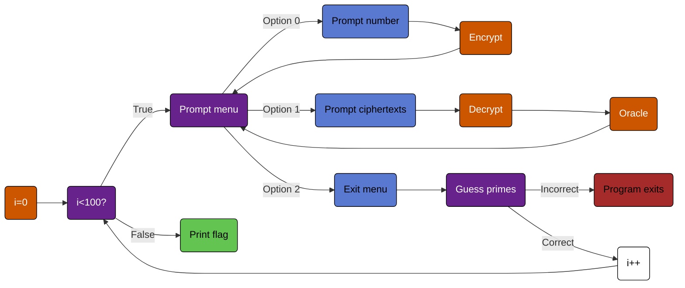

# Writeup for KITCTF 2022 'Prime Gusser 1' and 'Prime Guesser 2' Challenges
*Who needs math when you can just guess?*

## The Challenge
In this challenge, a connection to the server begins and the user is immediately bombarded with two lists of numbers.
```
377962,200034,230557,610044,171667,86688,943151,848941,382931,961223,705385,729217,185385,442830,149549,116951,679483,499023,706614,477131,13777,65174,442175,377983,814558,984299,115508,235243,232673,166789,809773,856798,526446,675718,399685,874823,303414,495553,749816,787954,573900,439826,832348,563436,1039490,82861,697843,988802,888514,249047,790497,76606,188407,91832,667104,674584,208913,242545,717322,384867,757719,977174,927325,140953
245003,564865,423551,794916,1030099,715438,951297,104647,51670,129918,793465,528650,939860,52534,990641,781658,964589,582634,823047,235310,794195,473151,338700,945267,800066,967209,304320,684236,765430,832074,499153,735036,838025,447156,527498,524078,154154,878862,374040,322169,318428,815100,447328,217752,140044,266616,902978,853001,698526,261289,392639,763882,260894,665244,874182,1031487,207823,842837,81426,398136,945841,950746,1025753,214976
```
Thereafter the server asks the user what they want. The server does not provide any options for the user; however looking at the code shows that there are three acceptable actions.
```python
    while True:
        choice = int(input("What do you want?\n").strip())
        if choice == 0:
            number_input = int(input("What do you want to encrypt?\n").strip(), 10)
            if number_input > 20 or number_input < 1:
                print("Thats out of bound")
            else:
                outputCipher(smart_enrypt(number_input))
        elif choice == 1:
            cipher_input = input("What is the first part of the Cipher?\n").strip()
            c0 = [int(n, 10) for n in cipher_input.split(",")]
            cipher_input = input("What is the second part of the Cipher?\n").strip()
            c1 = [int(n, 10) for n in cipher_input.split(",")]
            c = (c0, c1)
            oracle(c)
        elif choice == 2:
            break
```
### Option 0
In option 0, the user can give the server a number in the range $[1, 20]$ for the server to encrypt. Once the number is encrypted, its entire output is returned to the user. Now this might initially seem incredibly useful; however, the restriction of input numbers in the range $[1, 20]$ really does not provide too much information. Here is an example output:
```
What do you want?
0
What do you want to encrypt?
1
80332,463780,792058,383640,670434,322669,186514,632518,109001,205518,245703,667775,838329,73292,494435,143250,1017494,875545,706464,46307,370376,760305,1010088,952492,758982,392160,934753,734356,937534,12157,935728,878926,392830,640827,165465,81185,91633,397062,573058,736689,897346,627208,1009605,405665,339680,833796,1032471,218936,475816,835618,1470,298054,793452,881959,562408,328171,506307,756656,844538,503920,725078,565773,1017419,164483
985494,73081,120524,1017959,318357,306968,634004,727418,527224,158725,753912,904952,814567,319821,317262,358766,793112,935679,658026,146112,753484,143127,1048145,902333,762674,563732,761630,638022,1007232,747055,750481,56746,303755,819763,1014514,673684,844447,820666,724373,731507,63228,735920,602701,437707,343858,1024297,334425,261636,519396,422632,520735,977994,770901,822921,367960,566980,402892,774181,811351,317380,480510,360153,895582,331365
```
### Option 1
In option 1, the user passes the server two lists of ciphertext, and after decrypting, the `oracle()` function is called which reveals whether the first index (0) of the decryption is equal to 0
```python
def oracle(c):
    p = decrypt(sk, n, q, t, poly_mod, c)
    print(p == 0)
```
Here is an example output using the ciphertext from Option 1 above.
```
What do you want?
1
What is the first part of the Cipher?
80332,463780,792058,383640,670434,322669,186514,632518,109001,205518,245703,667775,838329,73292,494435,143250,1017494,875545,706464,46307,370376,760305,1010088,952492,758982,392160,934753,734356,937534,12157,935728,878926,392830,640827,165465,81185,91633,397062,573058,736689,897346,627208,1009605,405665,339680,833796,1032471,218936,475816,835618,1470,298054,793452,881959,562408,328171,506307,756656,844538,503920,725078,565773,1017419,164483
What is the second part of the Cipher?
985494,73081,120524,1017959,318357,306968,634004,727418,527224,158725,753912,904952,814567,319821,317262,358766,793112,935679,658026,146112,753484,143127,1048145,902333,762674,563732,761630,638022,1007232,747055,750481,56746,303755,819763,1014514,673684,844447,820666,724373,731507,63228,735920,602701,437707,343858,1024297,334425,261636,519396,422632,520735,977994,770901,822921,367960,566980,402892,774181,811351,317380,480510,360153,895582,331365
False
```
### Option 2
In option 2, the user simply breaks form the menu option loop and is then subsequently asked for the factors of a randomly generated prime number whose ciphertext was provided prior. Here is an example output:
```
What do you want?
2
What are the factors?
3,5,7
Failed
```
## Overall Program Function
In order to get the flag from the server, the prime factors of the randomly generated number must be guessed correctly 100 times in a row. Menu options 0 and 1 above can be repeated as many times as the user would like within each loop to gather any necessary information. Here is a graph of the process:

## Encryption Analysis
Now that the program's flow is understood, we must delve deeper. Since this is a cryptography challenge we need to actually look at what's going on behind the scenes, and if we are lucky there will be a simple way to break the encryption and decrypt the random number's ciphertext each round. However, before the exploration into the encrpytion and decryption functions may begin, there are some global variables that must be covered
```python
# polynomial modulus degree
n = 2**6 # EXAMPLE !!! ON THE SERVER ARE OTHER NUMBERS
# ciphertext modulus
q = 2**20 # EXAMPLE !!! ON THE SERVER ARE OTHER NUMBERS
# plaintext modulus
t = 2**10 # EXAMPLE !!! ON THE SERVER ARE OTHER NUMBERS
# polynomial modulus
poly_mod = np.array([1] + [0] * (n - 1) + [1])
pk, sk = keygen(n, q, poly_mod)
```
I've gone through the painstaking trouble of politely labelling each variable up above, and the creators of the challenge were also so helpful in informing us that none of these variables are the same as on the server. However, they did provide a general formula for their creation; that is, $n$, $q$, and $t$ were all of the form $2^i$ where $i\in\mathbb{Z}^*$ and surely $i$ cannot be *too* big? or else this program would be unmanageable. Nonetheless, while the form of these variables is known, they are still to be considered unknown. What's perhaps more interesting than these three variables is $polymod$ which takes the form:
```python
array([1, 0, 0, 0, 0, 0, 0, 0, 0, 0, 0, 0, 0, 0, 0, 0, 0, 0, 0, 0, 0, 0, 0, 0, 0, 0, 0, 0, 0, 0, 0, 0, 0, 0, 0, 0, 0, 0, 0, 0, 0, 0, 0, 0, 0, 0, 0, 0, 0, 0, 0, 0, 0, 0, 0, 0, 0, 0, 0, 0, 0, 0, 0, 0, 1])
```
What significance does this have? I did not know at this point, but nonetheless it is fully determined by the value of $n$, which is good since that means that finding $n$ gives the value of two global variables used in encryption. The final two global variables are $pk$ and $sk$ which are generated by a function named `keygen` that accepts $n$, $q$, and $polymod$ as arguments.
```python
def keygen(size, modulus, poly_mod):
    sk = gen_binary_poly(size)
    a = gen_uniform_poly(size, modulus)
    e = gen_normal_poly(size)
    b = polyadd(polymul(-a, sk, modulus, poly_mod), -e, modulus, poly_mod)
    return (b, a), sk
```
Now this is the point in the cryptography analysis that randomness joins the party and really puts a damper on my mood. Randomness is required in ciphers to make them *confusing* and *complex*, and it sure does make my life difficult in CTFs. Anyway, `keygen` calls four unqiue separate functions: `gen_binary_poly`, `gen_uniform_poly`, `gen_normal_poly`, and `polyadd`. The code for these is short and sweet (though clustered), so let's take a look.
```python
def polyadd(x, y, modulus, poly_mod):
    return np.int64(np.round(poly.polydiv(poly.polyadd(x, y) % modulus, poly_mod)[1] % modulus))
```
```python
def gen_binary_poly(size):
    return np.random.randint(0, 2, size, dtype=np.int64)
```
```python
def gen_uniform_poly(size, modulus):
    return np.random.randint(0, modulus, size, dtype=np.int64)
```
```python
def gen_normal_poly(size):
    return np.int64(np.random.normal(0, 2, size=size))
```
Let's start with `polyadd`, it's pretty simple if you don't look to much into it (I did and wouldn't reccommend it) and essentually just adds two polynomials 
### Encryption Function Analysis
The encryption function accepts three parameters: `pk, size, q, t, poly_mod, pt`
  ```mermaid
graph TD
    classDef default fill:#5978cf,stroke:#000,color:#000
    classDef input fill:#64c452,stroke:#000,color:#000
    classDef function fill:#c97038,stroke:#000,color:#000

    size:::input--> m
    pt:::input--> m

    q:::input-->delta
    t:::input-->delta

    m --> scaled_m
    delta --> scaled_m
    q:::input--> scaled_m


    size --> gen_normal_poly
    size --> gen_binary_poly
    gen_normal_poly:::function --> e1
    gen_normal_poly:::function --> e2
    gen_binary_poly:::function --> u

    pko:::input --> ct0
    u --> ct0
    q --> ct0
    poly_mod:::input --> ct0
    e1 --> ct0
    scaled_m --> ct0

    pk1:::input --> ct1
    u --> ct1
    q --> ct1
    poly_mod -->ct1
    e2 --> ct1
  ```
## gen_binary_poly
## gen_uniform_poly
## gen_normal_poly

### Decryption Function Analysis


### Polynomials


## Finding Q


## Finding T


## Finding SK


## Prime Guesser 1 Solution


## Prime Guesser 2 Solution


## Conclusion
